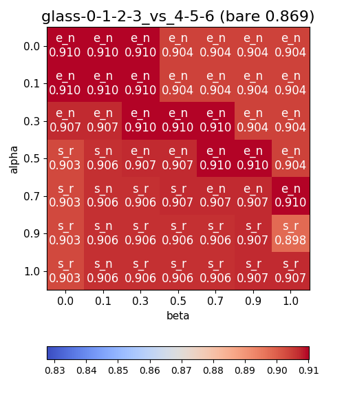
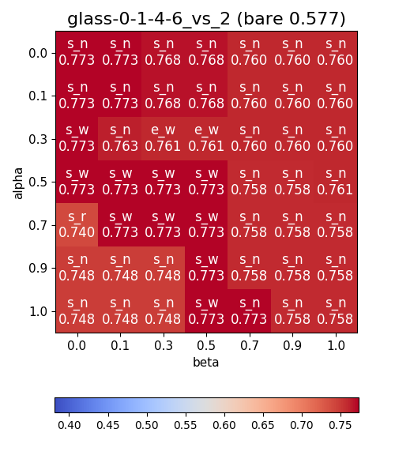
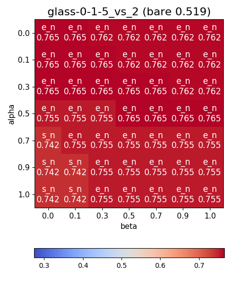
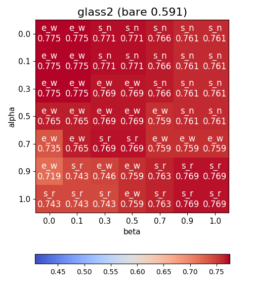
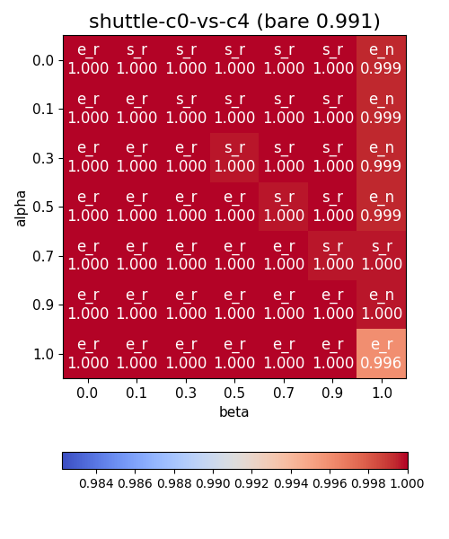
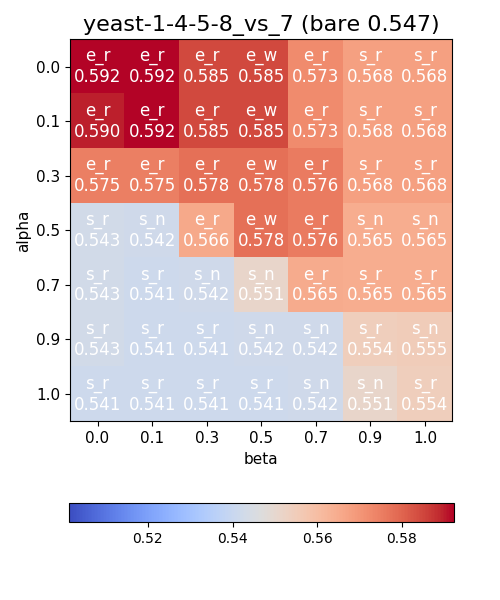

# Multi-class imbalanced data classification based on feature selection techniques

> The difficulty of the many practical decision problem lies in the nature of analyzed data. One of the most important real data characteristic is imbalance among examples from different classes. Despite more than two decades of research, imbalanced data classification is still one of the vital challenges to be addressed. The traditional classification algorithms display strongly biased performance on imbalanced datasets. In this work a novel classifier ensemble forming technique for multi-class imbalanced datasets is presented, which takes into consideration on the one hand selected features used for training individual classifiers, but on the other hand it ensures an appropriate diversity of a classifier ensemble. The proposed approach has been evaluated on the basis of the computer experiments carried out on the benchmark datasets. Their results seem to confirm the usefulness of the proposed concept in comparison to the state-of-art methods.

## australian

#### Summary

#### e_r

#### e_w

#### e_n

#### s_r

#### s_w

#### s_n

## glass-0-1-2-3_vs_4-5-6

#### Summary

#### e_r

#### e_w

#### e_n

#### s_r

#### s_w

#### s_n

## glass-0-1-4-6_vs_2

#### Summary

#### e_r

#### e_w

#### e_n

#### s_r

#### s_w

#### s_n

## glass-0-1-5_vs_2

#### Summary

#### e_r

#### e_w

#### e_n

#### s_r

#### s_w

#### s_n

## glass-0-1-6_vs_2

#### Summary

#### e_r

#### e_w

#### e_n

#### s_r

#### s_w

#### s_n

## glass-0-1-6_vs_5

#### Summary

#### e_r

#### e_w

#### e_n

#### s_r

#### s_w

#### s_n

## glass-0-4_vs_5

#### Summary

#### e_r

#### e_w

#### e_n

#### s_r

#### s_w

#### s_n

## glass-0-6_vs_5

#### Summary

#### e_r

#### e_w

#### e_n

#### s_r

#### s_w

#### s_n

## glass0

#### Summary

#### e_r

#### e_w

#### e_n

#### s_r

#### s_w

#### s_n

## glass1

#### Summary

#### e_r

#### e_w

#### e_n

#### s_r

#### s_w

#### s_n

## glass2

#### Summary

#### e_r

#### e_w

#### e_n

#### s_r

#### s_w

#### s_n

## glass4

#### Summary

#### e_r

#### e_w

#### e_n

#### s_r

#### s_w

#### s_n

## glass5

#### Summary

#### e_r

#### e_w

#### e_n

#### s_r

#### s_w

#### s_n

## glass6

#### Summary

#### e_r

#### e_w

#### e_n

#### s_r

#### s_w

#### s_n

## heart

#### Summary

#### e_r

#### e_w

#### e_n

#### s_r

#### s_w

#### s_n

## hepatitis

#### Summary

#### e_r

#### e_w

#### e_n

#### s_r

#### s_w

#### s_n

## page-blocks-1-3_vs_4

#### Summary

#### e_r

#### e_w

#### e_n

#### s_r

#### s_w

#### s_n

## pima

#### Summary

#### e_r

#### e_w

#### e_n

#### s_r

#### s_w

#### s_n

## ring

#### Summary

#### e_r

#### e_w

#### e_n

#### s_r

#### s_w

#### s_n

## shuttle-c0-vs-c4

#### Summary

#### e_r

#### e_w

#### e_n

#### s_r

#### s_w

#### s_n

## shuttle-c2-vs-c4

#### Summary

#### e_r

#### e_w

#### e_n

#### s_r

#### s_w

#### s_n

## vowel0

#### Summary

#### e_r

#### e_w

#### e_n

#### s_r

#### s_w

#### s_n

## wisconsin

#### Summary

#### e_r

#### e_w

#### e_n

#### s_r

#### s_w

#### s_n

## yeast-0-2-5-6_vs_3-7-8-9

#### Summary

#### e_r

#### e_w

#### e_n

#### s_r

#### s_w

#### s_n

## yeast-0-2-5-7-9_vs_3-6-8

#### Summary

#### e_r

#### e_w

#### e_n

#### s_r

#### s_w

#### s_n

## yeast-0-3-5-9_vs_7-8

#### Summary

#### e_r

#### e_w

#### e_n

#### s_r

#### s_w

#### s_n

## yeast-0-5-6-7-9_vs_4

#### Summary

#### e_r

#### e_w

#### e_n

#### s_r

#### s_w

#### s_n

## yeast-1-2-8-9_vs_7

#### Summary

#### e_r

#### e_w

#### e_n

#### s_r

#### s_w

#### s_n

## yeast-1-4-5-8_vs_7

#### Summary

#### e_r

#### e_w

#### e_n

#### s_r

#### s_w

#### s_n

## yeast-2_vs_4

#### Summary

#### e_r

#### e_w

#### e_n

#### s_r

#### s_w

#### s_n

## yeast-2_vs_8

#### Summary

#### e_r

#### e_w

#### e_n

#### s_r

#### s_w

#### s_n

## yeast1

#### Summary

#### e_r

#### e_w

#### e_n

#### s_r

#### s_w

#### s_n

## yeast3

#### Summary

#### e_r

#### e_w

#### e_n

#### s_r

#### s_w

#### s_n

## yeast4

#### Summary

#### e_r

#### e_w

#### e_n

#### s_r

#### s_w

#### s_n

## yeast5

#### Summary

#### e_r

#### e_w

#### e_n

#### s_r

#### s_w

#### s_n

## yeast6

#### Summary

#### e_r

#### e_w

#### e_n

#### s_r

#### s_w

#### s_n

